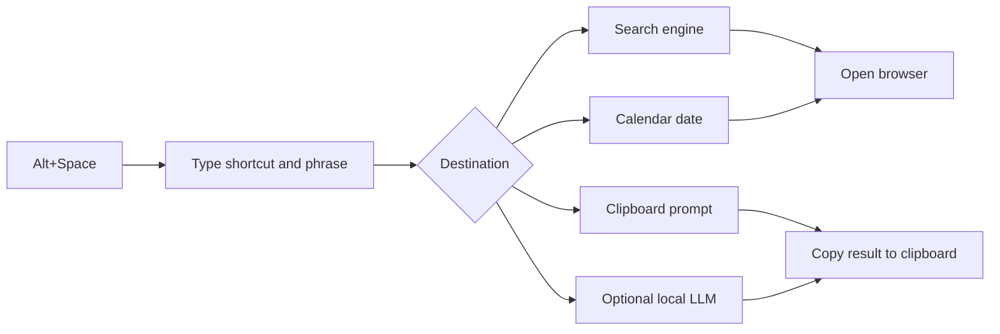

# PowerToys Run Browse

> A small keyboard-first launcher for the web searches and clipboard actions you repeat every day.

PowerToys Run Browse gives common destinations a memorable shortcut. Type one command, add a phrase when you need one, and open the right search or helper without reaching for bookmarks or navigating a menu.

It is intentionally lightweight: a Python script, a set of readable shortcuts, and an optional local language-model connection for clipboard-based grammar cleanup.

[](https://github.com/engrbugs/powertoys-run-browse)

*A quick look at the launcher workflow.*

## Why it is useful

The time savings come from removing tiny interruptions:

- `q definition` opens a Google definition search
- `y ambient music` opens the matching YouTube results
- `g python pathlib` searches GitHub
- `s list comprehension` searches Stack Overflow
- `4 mellifluous` opens OneLook's reverse dictionary
- `8 tomorrow` opens the matching Google Calendar day
- `C 1` copies a grammar-fixing prompt using the current clipboard text
- `X1` sends clipboard text to the configured local grammar helper, when available

The result is not a new browser or a replacement for PowerToys Run. It is a thin personal command layer that makes a familiar Windows launcher more useful.

## How it works



## Included shortcuts

| Shortcut | Opens or performs |
| --- | --- |
| `q` | Google definition search |
| `w` | Google thesaurus search |
| `y` | YouTube search |
| `4` | OneLook reverse dictionary |
| `p` | Google pronunciation search |
| `g` | GitHub search |
| `s` | Stack Overflow search |
| `8` | Google Calendar, including phrases such as `today` or `tomorrow` |
| `R` / `T` / `L` / `B` | Reddit, Twitter, Ludwig, or Bible |
| `C` | Choose a reusable ChatGPT prompt and copy it |
| `C1` | Copy the grammar-fix prompt using clipboard text |
| `X1` | Run the optional local auto-grammar flow |

Shortcuts are defined near the top of `qq.py`, so adding or changing a destination does not require a framework or a build step.

## Setup

### Requirements

- Windows
- Python 3
- [Microsoft PowerToys](https://learn.microsoft.com/windows/powertoys/) for the Run launcher
- Dependencies in [`requirements.txt`](requirements.txt)

Install the dependencies:

```powershell
py -m pip install -r requirements.txt
```

Create a launchable shortcut to `qq.py`, name the shortcut `qq`, and place it in:

```text
C:\ProgramData\Microsoft\Windows\Start Menu\Programs
```

Then press `Alt+Space`, type `qq`, and enter a shortcut plus an optional search phrase.

## Optional local grammar helper

The `X1` shortcut reads the current clipboard, builds a preservation-focused correction prompt, and sends it to the local HTTP model endpoint configured in `qq.py`. It supports several common local API shapes and copies the returned correction back to the clipboard.

This feature is optional. Browser shortcuts and the copy-only prompt helpers do not require an LLM server. If you use `X1`, review `SERVER_URL` and `LLM_MODEL` for your own local setup before running it.

## Latest update · local LLM shortcut

The local LLM shortcut is configured in `qq.py` with the following defaults:

```python
SERVER_URL = "http://192.168.1.88:5000"
TARGET_TPS = 50
LLM_MODEL = "local-model"
DEFAULT_CONTEXT_TOKENS = 8192
MAX_INPUT_CONTEXT_RATIO = 0.4
EXIT_PAUSE_SECONDS = 2
```

Use `X1` from PowerToys Run to send the current clipboard text to that local server for automatic grammar cleanup. The helper detects the model context window when possible, avoids sending oversized clipboard contents, and copies the corrected result back to the clipboard.

The endpoint above is a private local-network address. Replace it with the address and model name used by your own local LLM server before sharing the setup with another machine.

## Project layout

- `qq.py` — shortcut registry, browser routing, calendar parsing, prompts, and optional local-model calls
- `clipboard.py` — small clipboard helper
- `requirements.txt` — runtime dependencies
- `readme-images/` — usage animation

PowerToys Run Browse is a personal productivity utility: small enough to understand, easy to customize, and useful precisely because it stays close to the way you already work.
